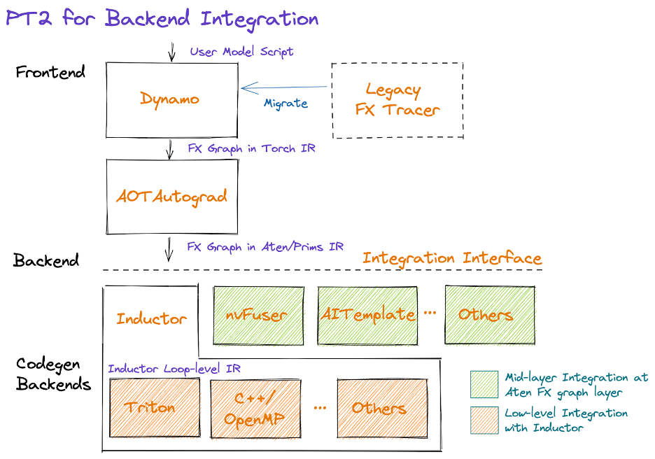

# day 2024-05-29

目标：为custom算子库接入pytorch-2.x提供方便快捷的途径

pytorch2.x特性, torch.compile，[链接](https://pytorch.org/get-started/pytorch-2.0/#pytorch-2x-faster-more-pythonic-and-as-dynamic-as-ever)

接入技术路线




# day 2024-05-30

注意：这里的后端是指在pytorch已支持的device上新加的。
pytorch的两种backend接入方式：

- at the AtenIR/PrimsIR level <br>
  这种方式更直接，可以很好地对捕获到的计算图进行优化，但如果接入的后端不能提供很好的算子编译器，就不能获得很好的性能，这是因为在AtenIR/PrimsIR获得的计算图中的算子是细粒度的。比如Layernorm算子会表现为许多算术运算算子（如add、reducemean、div等）的组合。 <br>
  这种接入方式是在编译时（compile time）实现的，需要修改并重新编译pytorch的源码，这对开发者并不友好，且很容易落后于pytorch的主线版本。

- at the Inductor loop IR level <br>
  pytorch2.0 开始提供了新的接入方式，基于TorchInductor的运行时接入，TorchInductor是torch.compile的子部件，后者可以在运行时以python字节码的形式捕获pytorch的moudule，并且TorchInductor会做一部分的算子融合和其他优化工作，此时，接入的新后端只需要专注于生成优化的算子。 <br>
  这种接入方式是out of tree的，不需要重新更改pytorch的源码并编译。

目前pytorch以内嵌（in tree）的方式提供了两个TorchInductor后端：triton和C++/openMP，前者用于GPU上的代码生成，后者用于CPU，triton目前支持NV和AMD的GPU，Intel也对triton进行了扩展以支持自己的GPU（目测寒武纪的triton-linalg也在此列）。

虽然TorchInductor的重点在于算子自动生成，但也可以用来接入手写的算子库，intel的IPEX-XPU就是如此，不仅支持基于triton在XPU上生成kernel，还提供了oneDNN、oneMKL中的手写算子库。

一个相关[RFC(request for comments)](https://github.com/pytorch/pytorch/issues/99419) <br>
一个相关[PR(pull request)](https://github.com/pytorch/pytorch/pull/100706)

# day 2024-06-19

使用`PrivateUse1`引入新的后端设备，
代码位置`/pytorch-v2.3.0/c10/core/DeviceType.h:57`

从Pytorch 2.0开始, PyTorch为out-of-tree的后端扩展（不更改torch源码）提供了三个预留的dispatch keys及它们相应的Autograd keys:
```sh
PrivateUse1/AutogradPrivateUse1
PrivateUse2/AutogradPrivateUse2
PrivateUse3/AutogradPrivateUse3
```
开发者可以使用这些关键字来引入新的设备，如CUDA、XLA等

提供这些关键字的原因是：
1. 在此之前，每次引入新的后端都意味着大量的文件修改（torch的源码越来越臃肿）
2. Dispatch Keys使用64-bit变量类型，有硬性上限（认真的吗(+_+)?

昇腾NPU就是使用PrivateUse1引入的。

```sh
python setup.py --sycl_dir=$LLVM_PATH --onednn_dir=$DNNLROOT
```